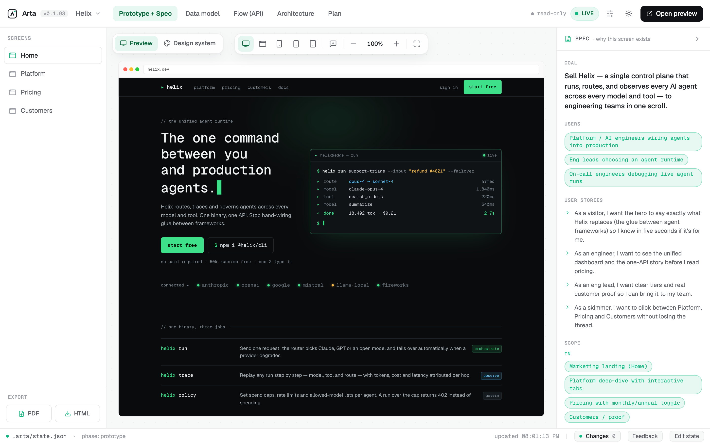

<div align="center">


# Arta

**Watch your AI design your app — live, on a canvas you can actually see.**

A live design canvas for the AI-coding era. Your coding agent designs the app onto a
screen you watch in real time — full prototype, spec, data model, flow, architecture,
and plan — instead of replying with a wall of text. Free, open-source, runs on your
machine.

[](https://github.com/AssetsArt/arta/blob/main/.claude-plugin/plugin.json)
&nbsp;
&nbsp;[](LICENSE)

<sub>by **Assets Art**</sub>

</div>

[](docs/arta-hero-light-2.png)

<div align="center"><sub><em>The Arta viewer with its seeded demo — <strong>Helix</strong>, a landing site for a "unified runtime for AI agents." The light chrome is Arta; the prototype lives inside the device frame.</em></sub></div>

## Quick start

**1. Install the plugin** — in Claude Code:

```text
/plugin marketplace add AssetsArt/arta
/plugin install arta@arta
/reload-plugins
```

**2. Design** — tell it what to build:

```text
/arta:arta a checkout flow for a coffee shop
```

Arta brainstorms the idea with you first, then designs it onto a live canvas — the
viewer opens itself at `http://localhost:7317` (first run needs [Bun](https://bun.sh)).
Update anytime with `/arta update`, or just say *"design this in Arta"*.

> No plugin? Run the viewer straight from any project: `bunx github:AssetsArt/arta`.

## Update

To pull the latest version — in Claude Code:

```text
/plugin marketplace update arta
/reload-plugins
/arta:arta restart
```

`/plugin marketplace update arta` bumps the plugin, `/reload-plugins` loads the new
skill / commands / MCP into the running session, and `/arta:arta restart` re-runs the
viewer from the new build (an already-open viewer keeps serving the old assets until
it's restarted). Then **hard-refresh** the browser tab (Cmd/Ctrl+Shift+R) so it drops
any cached assets. `/arta:arta update` wraps the first two steps and the restart in one.

> Stubborn cache? `rm -rf ~/.claude/plugins/cache/arta` → `/plugin install arta@arta` → restart Claude Code.

## Commands

Everything you can type, in one place.

**In Claude Code** — slash commands:

| Command | What it does |
|---|---|
| `/plugin marketplace add AssetsArt/arta` | Add the marketplace (one time) |
| `/plugin install arta@arta` | Install the plugin — skill + MCP + viewer |
| `/arta:arta <what to build>` | Brainstorm the idea, then design it in Arta |
| `/arta:arta update` | Update the plugin to the latest **and re-run the viewer** on the new build |
| `/arta:arta restart` | Re-run the viewer from the installed plugin (pick up a new build, no manual cache-clearing) |
| `/arta:arta open` | Just bring the canvas up — no designing. Look at the prototype, or switch between projects one viewer hosts (`arta_start_viewer`) |
| `/arta:arta feedback` | Drain the comments the dev left in the viewer and act on them (`arta_get_feedback`) |
| `/arta:arta review [screen]` | Design-quality pass — Arta's own offline anti-slop detector flags the tells (error → warn → info) and you fix them (`arta_design_review`) |
| *"design this in Arta"* | Natural-language trigger — same as `/arta:arta` |

`/arta update` wraps `/plugin marketplace update arta` then
`/plugin update arta@arta` (or use `/plugin` → Manage → Update),
then restarts the viewer via `arta_restart_viewer` so the new build shows up — after
you **restart Claude Code** so the updated skill/commands/MCP load. Normally you never
start the viewer yourself — `/arta:arta` does it via the `arta_start_viewer` tool, and
`/arta:arta restart` re-runs it.

**In your shell** — only if you want the viewer *without* the plugin:

| Command | What it does |
|---|---|
| `bunx github:AssetsArt/arta` | Run the viewer in the current project (`:7317`) |
| `bun pm cache rm` | Force `bunx` to re-fetch the latest (it caches `github:` specs) |
| `bunx github:AssetsArt/arta --project <dir>` | Point the viewer at another project |
| `bunx github:AssetsArt/arta --port <n>` | Use a different port (default `7317`) |

**Develop / contribute** — in a clone of this repo:

| Command | What it does |
|---|---|
| `bun install` | Install deps |
| `bun run dev` | Viewer on `:7317`, watching this repo's `.arta/` |
| `bun run build` | Typecheck + build viewer + bundle the MCP |
| `bun run build:mcp` | Re-bundle the MCP after editing `mcp/server.mjs` |
| `bun run eval:gate` | Run the deterministic regression gate (committed targets + render-layer / slop-detector / cookbook specs) |
| `node scripts/validate-plugin.mjs` | Check the plugin layout (the CI gate) |
| `bun link` | Expose a global `arta` command, runnable from any project |

## What it looks like

A canvas you leave open beside your agent while it designs your app, screen by
screen, in real time. Each project isn't just a prototype mockup — it carries the
whole thinking behind it:

- **Prototype + Spec** — real, clickable screens *and* why each one exists
- **Data model** — entities as an ER diagram
- **Flow (API)** — routes, middleware, and which screens call them
- **Architecture** — a C4-style system diagram + the decisions behind it
- **Plan** — a Kanban of milestones and tasks

Preview any screen across **web / desktop / iOS / iPad / Android** frames, swap
design systems, and let a built-in **design review** catch anything that looks
AI-generated.

| Data model — entities as an ER diagram | Flow (API) — routes, middleware & screen→API edges |
|---|---|
| [](docs/arta-data-model-light.png) | [](docs/arta-api-flow-light.png) |
| **Architecture — C4 system diagram + ADRs** | **Plan — a Kanban of milestones & tasks** |
| [](docs/arta-architecture-light.png) | [](docs/arta-plan-light.png) |

One canvas, five views. The prototype is real HTML (the demo is a terminal-native
design system — near-black, monospace-forward, one phosphor-green accent, a live CLI
hero, a Monthly/Annual pricing toggle), and the data model, API flow, architecture,
and plan are all read from the same `state.json` the agent writes.

Three layers, one loop:

| Layer | What it is |
|---|---|
| **Viewer** | A React + Vite + Tailwind app showing five tabs rendered from the canvas. The prototype is **freeform**: the agent writes real HTML + a shared CSS design system per screen, in a real device frame, wired up with a few attributes. |
| **Canvas** | A `.arta/` folder in your project. The agent writes it with its normal tools (or the MCP); the viewer watches it and live-reloads in place with a cyan flash. |
| **Skill + MCP** | A Claude Code skill drives the phases; an MCP server is the agent's eyes & hands — it edits the canvas, *sees* its own render (screenshots) and errors, and reads your feedback. |

## How it works

```
1. You give the brief in Claude Code → Arta brainstorms first
   (asks one question at a time, proposes 2–3 directions, agrees on one)
2. The agent designs onto the canvas — writing spec / data model / flow live on screen
3. You watch it repaint, click through the screens, and leave comments on any element
4. The agent reads your feedback → revises → repeat until it's right
5. The settled spec / data model / API = the blueprint the agent builds for real
```

Try the viewer by hand: click between the **Helix** screens in the **Prototype**
sidebar, flip the **Monthly / Annual** toggle on Pricing (the prices swap live), switch
the **Orchestrate / Observe / Govern** tabs on Platform, change device frames
(Web / Desktop / iOS / iPad / Android), **Comment** on an element, follow the
**Changes** feed, collapse the **Spec** rail, or hit **Edit state** to paste new state.

## How the canvas works

### Freeform prototype

Each prototype screen is real HTML in a sandboxed `<iframe>`, sharing a CSS
`designSystem`. **Tailwind** (`@tailwindcss/browser@4`) and **lucide** icons are
loaded into every screen from a CDN, so the AI writes real utility classes
(**not** inline `style="…"`) and `<i data-lucide="…">` icons — not emoji. Five
brand-grade web fonts (Geist, Geist Mono, Instrument Serif, Fraunces, Space Grotesk)
are preloaded for premium type pairings. Interactivity is wired with a tiny attribute
vocabulary — no framework, no backend:

| Attribute | Effect |
|---|---|
| `data-to="screenId"` | click navigates to another screen |
| `data-inc` / `data-dec="cart"` | bump a numeric mock-store key by ±1 |
| `data-set="key=value;k2=2"` | set store keys on click |
| `data-bind="cart"` | element text shows the live store value |
| `data-show="cart"` / `data-show="step==2"` | show element only when truthy / equal |
| `data-nav="screenId"` | the current screen's link gets `.is-active` automatically |

The mock `store` (declared in `prototype.store`) persists across navigation, so a
cart filled on one screen is still full on the next — the AI reads it via
`arta_get_view`.

### Shared layout & components — don't repeat markup

A `prototype.layout` shell wraps every screen body and `prototype.components` holds
reusable fragments, so a header lives in **one** place. Change it once, every screen
updates; nothing is missed.

- `prototype.layout` — `"{{>header}}{{slot}}{{>footer}}"` (`{{slot}}` = screen body)
- `prototype.components` — `{ "header": "…", "footer": "…" }`, included via `{{>name}}`
- `prototype.vars` / `screen.vars` — `{{name}}` variables for per-screen tweaks

Each screen's `html` is then only the part that differs; set `"layout": false` on a
screen to render it standalone.

### Brand-grade design systems

The skill ships a library of opinionated, ready-to-adapt design languages
(`skills/arta/design-systems.md`) — **Ink** (editorial), **Graphite**
(technical dark), **Clay** (warm commerce), **Mist** (calm SaaS), **Signal** (bold
display). The AI picks one for the brief, swaps in the project's accent, and sets it as
the prototype's foundation (`arta_set_design_tokens` + `designSystem`) before
building any screen — so output looks *designed*, not like a generic AI webpage. Pair
that with `/arta:arta review` (anti-slop) for a craft pass.

### Device frames

Preview the same HTML in different shells via `prototype.frame` (or a per-screen
`frame`): **`web`** (browser, default), **`desktop`** (native app window), **`ios`**,
**`ipad`**, and **`android`** (phone/tablet frames with status bar, notch / punch-hole,
home indicator). Phone frames render at ~390px so your responsive CSS kicks in. A frame
switcher in the sidebar previews any screen in any frame; the AI's declared frame is
the default and wins whenever it changes. For a full-bleed phone screen, set
`safeArea` (per screen or `prototype.safeArea`) to the edge colour so the status-bar
and home-indicator bands take that colour instead of staying white — status-bar
contents auto-contrast. Or set `chrome: false` for **Full** mode — no status bar or
home indicator at all, the design fills the whole screen (there's also a Full-screen
toggle in the frame switcher for previewing it).

### Split into files (so it scales)

A single `state.json` holding every screen's HTML would balloon as the prototype
grows — and an agent would burn context reading and rewriting the whole blob to
change one button. So the canvas is split: `state.json` keeps a small **manifest**,
and each screen / component / the design system lives in its own file. The agent
edits **one file at a time**; the dev server re-assembles them into one state for
the viewer. Inline values in `state.json` still work and win over files, for quick
lo-fi screens.

```
.arta/
  state.json                  # meta/spec/plan/dataModel/flow + prototype MANIFEST (no HTML)
  prototype/design-system.css # shared CSS
  prototype/components/*.html # shared fragments ({{>name}})
  prototype/screens/*.html    # each screen body
```

## How the AI plugs in

The plugin registers a self-contained MCP server (no extra install) that operates
on the current project's `.arta/`:

- `arta_get_state` / `arta_set_state` / `arta_patch_state` — read & write the structured canvas + prototype manifest. `get_state` takes `{ outline: true }` (a cheap index of sections + counts + sizes) or `{ sections: [...] }` (only the keys you want) so large projects don't pay for the whole blob each time. In `patch_state`, top-level keys replace, but `meta` and `prototype` **deep-merge** — a partial `{ prototype: … }` patch keeps the tokens / components / screens it omits instead of wiping them
- `arta_get_spec` / `arta_get_data_model` — read just the `spec` or `dataModel` section on its own (token-cheap grounding); write them via `arta_patch_state`
- `arta_get_screen` / `arta_set_screen` — read/write one screen body (one file)
- `arta_get_component` / `arta_set_component` — read/write one shared fragment
- `arta_get_design_system` / `arta_set_design_system` — the shared CSS
- `arta_get_design_tokens` / `arta_set_design_tokens` — the structured design system (colors, typography, spacing, radii, shadows, fonts); shown as a style guide in the Prototype → **Design system** sub-view, and compiled to CSS custom properties (`--color-*`, `--space-*`, …) injected into every screen
- `arta_set_phase` / `arta_set_frame` — record the current phase (shown in the status bar; tabs are free routes) / set the device frame, the `safeArea` colour (paints a phone's status-bar + home-indicator bands for full-bleed ios/android screens), and/or `chrome` (`false` = Full / no safe area, content fills the whole screen)
- `arta_get_api` / `arta_set_api` — the `api` section (the Flow tab): an OpenAPI 3 document — routes, middleware, params, body, responses, and `x-screens` (which screens call each route → screen→API edges)
- `arta_get_architecture` / `arta_set_architecture` — the `architecture` section (the Architecture tab): C4-style system diagram (nodes/edges), ADRs (`decisions`), `nfrs`, `security` notes, `stack`
- `arta_get_plan` / `arta_set_plan` / `arta_set_task` — the `plan` Kanban board (custom statuses = columns, milestones = swimlanes, tasks = cards w/ priority); `set_task` moves a card between columns
- `arta_start_viewer` — launch the viewer from the installed plugin (idempotent; no stale cache)
- `arta_restart_viewer` — re-run the viewer from the installed plugin so it serves the latest build (what `/arta:arta update` / `/arta:arta restart` use; no manual cache-clearing)
- `arta_export` — pack the whole clickable prototype into a static, deployable folder (`<project>/dist/index.html`) for a **client demo** — the same faithful render as the live `/preview`, but **without the Arta navigator** (no floating button / sidebar), navigated only by the prototype's own `data-to` clicks. Returns ready-to-run deploy commands (Cloudflare Pages `npx wrangler pages deploy`, Netlify, local serve). Drops onto any static host; the `.arta/` source is untouched
- `arta_get_screenshot` — a PNG of how a screen actually renders (the pixels you see)
- `arta_design_review` — run Arta's own deterministic anti-slop detector over a screen's HTML and return craft findings ranked error → warn → info (gradient text, side-stripe borders, stripe backgrounds, cramped tracking, nested cards, transition:all, emoji-as-icon, italic headings, over-rounded cards, …). Offline and instant — no `npx`, no network
- `arta_get_view` — your active tab, prototype screen, store, and any prototype errors
- `arta_get_feedback` — notes you left, including the element you clicked to comment on

The skill (`skills/arta/`) tells the agent how to run the prototype-based
loop. The agent can also just `Write` files under `.arta/` — the watcher catches
them either way; the MCP tools add validation, manifest upkeep, screenshots, and the
feedback channel.

**Design → build.** When the design is approved, the agent hands off to implementation
with [`superpowers:subagent-driven-development`](https://github.com/obra/superpowers/blob/main/skills/subagent-driven-development/SKILL.md):
the **Plan** Kanban is the task list (one implementer subagent per card), and the
`.arta/` artifacts (spec, prototype HTML, data model, API) are the source of truth
each subagent reads. The agent moves cards (`arta_set_task`) as work lands, so the
dev watches the build advance on the same board they designed.

## Develop the tool

The dev commands live in [Commands → Develop / contribute](#commands)
(`bun install`, `bun run dev`, `bun run build`, …).

A seed project (**Helix** — the landing site shown above) is included so there's
something to look at immediately. `mcp/server.bundle.mjs` is what the plugin ships;
rerun `bun run build:mcp` after editing `mcp/server.mjs`.

CI (`.github/workflows/pack.yml`) keeps `main` installable: every push builds,
type-checks, validates the plugin layout, re-commits the MCP bundle if it drifted
from source, and **bumps the patch version** (via `scripts/bump-version.mjs`). The
version bump matters — `/plugin update` skips re-installing when the version is
unchanged, so without it a push would never reach users. So just push; the version
moves on its own and `/arta update` always gets the latest. (Needs *Settings →
Actions → Workflow permissions → Read and write*.)

## Layout

```
.claude-plugin/
  plugin.json                 # plugin manifest (install target)
  marketplace.json            # listing → /plugin marketplace add AssetsArt/arta
skills/arta/                  # the design-loop skill
commands/arta.md              # the /arta:arta command (design · update)
.mcp.json                     # MCP config (points at the bundle via ${CLAUDE_PLUGIN_ROOT})
mcp/server.mjs                # MCP server source — the agent's eyes & hands
mcp/server.bundle.mjs         # self-contained bundle the plugin ships (no dep install)
bin/arta.mjs                  # viewer launcher — `arta` in any project
vite/arta-watch.ts            # Vite plugin: assembles split files, watch → WebSocket push, endpoints
scripts/validate-plugin.mjs   # plugin-layout check (CI gate + local)
.github/workflows/pack.yml    # build · validate · re-bundle on push
src/                          # the viewer (React + Tailwind + shadcn-style + lucide)
.arta/                        # the canvas (seeded with the Helix demo)
```

## Stack

Bun · React 19 · Vite 6 · Tailwind CSS v4 · shadcn-style components · lucide-react ·
React Flow (`@xyflow/react`) + dagre for the data-model & API-flow diagrams ·
`yaml` for OpenAPI 3 export · TypeScript · `@modelcontextprotocol/sdk`. Fonts:
Geist / Geist Mono.

## License

**MIT.** Everything in this repo — the plugin, viewer, skill, and MCP server — is
[MIT licensed](LICENSE): free to use, fork, and self-host, forever.

---

<div align="center"><sub>Arta — by <strong>Assets Art</strong> · <a href="LICENSE">MIT licensed</a></sub></div>
